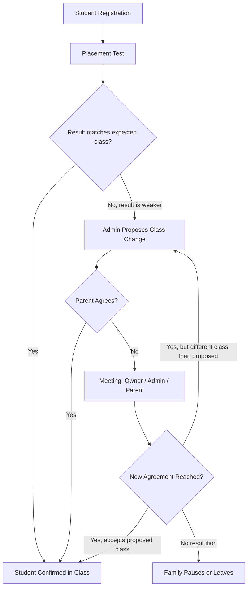

# Bimbel OS — Business Workflow

This document describes how a small, independent tutoring center ("bimbel") operates day to day, from opening to closing. It is a business-process view, not a software specification: it describes actors, activities, inputs, outputs, and pain points as they exist today, before any system is introduced.

## Actors

| Actor                | Typical Profile                                                                                                                   |
| -------------------- | --------------------------------------------------------------------------------------------------------------------------------- |
| **Owner**            | Founder/operator. Handles strategy, finance oversight, hiring, and often sales. May also teach.                                   |
| **Admin**            | Single point of coordination. Manages registration, scheduling, attendance follow-up, payment tracking, and parent communication. |
| **Teacher**          | Delivers classes. May be full-time, part-time, or paid per session.                                                               |
| **Parent / Student** | Customer. Parent typically handles enrollment and payment decisions; student attends class.                                       |

In a center of 1–200 students, these roles are rarely more than 3–5 people total, and the Owner and Admin roles are sometimes the same person.

## Daily Workflow — Opening to Closing

A representative operating day looks like this:

1. **Morning (before first class):** Admin reviews the day's class schedule, checks for teacher availability issues, and follows up on unpaid invoices from the previous cycle.
2. **Pre-class:** Admin or teacher confirms which students are expected in each session; last-minute cancellations or reschedule requests from parents (usually via chat) are handled individually.
3. **During class hours:** Teachers deliver sessions and mark attendance. Admin handles walk-in or phone inquiries from prospective parents, processes new registrations, and fields payment-related questions.
4. **Between sessions:** Admin reconciles attendance records collected from teachers and matches incoming payments to student accounts.
5. **End of day:** Admin tallies the day's enrollments, payments received, and attendance exceptions (absences, no-shows). Any urgent issues (a teacher no-show, a payment dispute) are escalated to the Owner.
6. **Closing:** Admin secures any physical records (attendance sheets, cash if collected in person) and prepares a short verbal or written update for the Owner, who reviews it at their convenience — often in the evening, outside business hours.

The Owner's involvement is typically not continuous through the day; it is concentrated at the start (setting priorities) and end (reviewing outcomes), with ad hoc escalations in between.

**Note:** The sequence above is a simplified skeleton of a "normal" day. In practice, almost none of the workflows below execute in a straight line — each one regularly branches, gets rejected, and loops back on itself before it settles. See [Non-Linear Flows & Feedback Loops](#non-linear-flows--feedback-loops) for how this actually plays out.

---

## 1. Student Registration

**Description:** The process of converting a prospective student into an enrolled, class-assigned student.

- **Who performs it:** Admin (primary contact), Owner (approves pricing exceptions or discounts), Parent (provides information and makes the decision).
- **Input:** Parent inquiry (walk-in, phone call, or chat message), student's grade level and subject needs, preferred schedule, family contact details.
- **Output:** A new student record with assigned class(es), an agreed fee, and a confirmed start date.
- **Pain points:**
  - Inquiries arrive through multiple, unlinked channels (chat, phone, in person), so nothing guarantees a lead is followed up or converted.
  - Student information is captured inconsistently — sometimes on paper, sometimes typed into a spreadsheet, sometimes only remembered.
  - Placing a student into the "right" class depends on the admin's personal knowledge of current class rosters and capacity, which does not scale past a certain size.
  - There is no reliable way to see enrollment history if a family re-enrolls after a gap, leading to repeated data entry and potential pricing inconsistencies.

## 2. Placement Test

**Description:** An assessment used to determine which class level actually fits a newly registered (or re-enrolling) student, since a student's stated grade level doesn't reliably indicate their actual ability in a subject.

- **Who performs it:** Teacher administers and scores the test; Admin schedules it and communicates the result; Owner is looped in if the result is disputed.
- **Input:** The registered student, a subject-appropriate test, the student's stated grade level as a starting assumption.
- **Output:** A recommended class placement, which may confirm or contradict the class the student was tentatively registered into.
- **Pain points:**
  - The test result frequently conflicts with what was informally promised to the parent at registration (e.g., "your child will be in the advanced class"), creating an immediate expectation gap.
  - There is no standard, agreed process for what happens next when a result is borderline or disputed — it is handled case-by-case by whoever is available.
  - A weak result is emotionally sensitive for the parent, so communicating it well (and consistently) matters as much as the result itself, yet there is no consistent way this is done today.
  - The test result is a point-in-time snapshot; there's no structured way to revisit placement later if the student's performance changes.

## 3. Class Reassignment & Escalation

**Description:** What happens when a student's class assignment needs to change after the fact — triggered by a placement test result, a teacher's observation, or a parent request — and the change is not immediately accepted by all parties.

- **Who performs it:** Admin proposes the change and communicates it; Parent accepts or objects; Owner (and sometimes the Teacher) gets pulled in for a meeting if the parent objects.
- **Input:** A trigger event (poor placement test result, teacher feedback, parent complaint, schedule conflict), the current class assignment, available alternative classes.
- **Output:** Either a confirmed new class assignment, a confirmed decision to keep the student in the original class, or — if no agreement is reached — the family disengaging (pausing or leaving).
- **Pain points:**
  - This is not a one-shot decision — it commonly loops: a proposed change is rejected, a meeting is held, a revised proposal is made, which may itself be rejected again.
  - There is no record of _why_ a past reassignment happened, so if the same student's placement is questioned again later, the reasoning has to be reconstructed from memory.
  - Resolving a disputed reassignment consumes disproportionate Owner and Admin time relative to how often it happens, because each case is handled from scratch rather than following a known playbook.
  - A drawn-out disagreement risks the family's trust and retention regardless of which class the student ends up in, and there's no way to track how often this pattern leads to a student leaving.

## 4. Scheduling

**Description:** Determining which classes run when, for which subjects and grade levels, and ensuring rooms/time slots don't conflict.

- **Who performs it:** Admin builds and maintains the schedule; Owner sets high-level policy (e.g., which subjects to offer, peak-hour capacity).
- **Input:** Available teachers and their working hours, subject/grade demand, physical space or time-slot constraints, prior term's schedule as a starting template.
- **Output:** A published class timetable that students, parents, and teachers can reference.
- **Pain points:**
  - The schedule lives in a format (spreadsheet, photo, printed sheet) that is hard to update and redistribute quickly when something changes.
  - Any change — a class needing to move, a new class being added — requires manually notifying every affected teacher and parent individually.
  - There is no easy way to see, at a glance, which time slots are over- or under-utilized across the whole center.
  - Conflicts (same teacher double-booked, same room double-booked) are typically caught by memory or luck rather than by a systematic check.

## 5. Teacher Assignment

**Description:** Matching teachers to classes based on subject expertise, availability, and — implicitly — performance/fit with certain student groups.

- **Who performs it:** Owner or Admin, depending on center size and how much authority the Owner delegates.
- **Input:** Teacher subject qualifications, teacher availability, class schedule, teacher workload/compensation model (per-session, salaried).
- **Output:** A confirmed teacher-to-class mapping for the term or cycle.
- **Pain points:**
  - Teacher availability changes (illness, personal conflicts) are communicated informally and often late, forcing reactive scrambling to find a substitute.
  - There is no consistent record of which teacher taught which class in the past, making it hard to track teacher performance or reliability over time.
  - Compensation calculations (especially per-session pay) depend on accurately knowing which sessions a teacher actually delivered, which loops back to attendance and scheduling accuracy.
  - Substitute coverage, when needed, is arranged ad hoc and may not be communicated clearly to parents or students in time.

## 6. Attendance

**Description:** Recording which students were present, absent, or late for each session.

- **Who performs it:** Teacher records attendance during or immediately after class; Admin later consolidates it.
- **Input:** The day's class roster, the teacher's in-the-moment observation of who showed up.
- **Output:** An attendance record per student per session, used later for parent communication, billing verification, and reporting.
- **Pain points:**
  - Attendance is often recorded on paper and only transcribed into a central record later — introducing delay, transcription error, or records that are never transcribed at all.
  - Different teachers apply different standards for what counts as "late" versus "absent," making the data inconsistent across classes.
  - There is no immediate visibility for the Admin or Owner into today's attendance without physically collecting sheets from each teacher.
  - Chronic absenteeism by a student is hard to spot early because attendance data isn't aggregated or reviewed regularly — it's usually noticed only when a parent complains or a refund is requested.

## 7. Payment Collection

**Description:** Collecting tuition fees from parents and reconciling them against what is owed.

- **Who performs it:** Parent initiates payment; Admin confirms and records it; Owner reviews aggregate cash position.
- **Input:** Agreed fee per student (from registration), payment proof (transfer receipt, screenshot, or cash), due date/billing cycle.
- **Output:** A confirmed payment record and an updated view of who has paid, who is late, and who is due for renewal.
- **Pain points:**
  - Payment proof arrives informally (a chat screenshot) and must be manually matched to the correct student and billing period — a step that is easy to get wrong or delay.
  - There is no single, current answer to "who owes money right now" — it requires cross-referencing multiple lists.
  - Late payments are chased manually and inconsistently, often only when the Admin has time, which means revenue collection depends on admin bandwidth rather than a repeatable process.
  - Discounts, sibling pricing, partial payments, and refunds are handled case-by-case and are not consistently recorded, creating disputes later about what a family actually owes.

## 8. Reporting

**Description:** Turning raw operational data (enrollments, attendance, payments) into information the Owner can act on.

- **Who performs it:** Admin compiles; Owner consumes and interprets.
- **Input:** Enrollment records, attendance records, payment records, teacher assignments — typically scattered across several spreadsheets, chat threads, and paper.
- **Output:** A periodic (weekly/monthly) summary of enrollment counts, revenue collected vs. outstanding, class utilization, and any notable exceptions.
- **Pain points:**
  - Compiling a report is manual and time-consuming, so it happens infrequently (monthly at best) rather than continuously.
  - Data pulled from different sources doesn't always agree (e.g., attendance-based revenue expectations vs. actual payments received), and reconciling the difference takes additional manual work.
  - Reports reflect a snapshot in the past by the time they're compiled, so the Owner is often making decisions on stale information.
  - There is no historical trend view (e.g., enrollment growth over the last six months) without manually assembling multiple past reports.

## 9. Owner Monitoring

**Description:** The Owner's ongoing oversight of business health — financial, operational, and people-related — and the decisions that follow from it.

- **Who performs it:** Owner, informed by Admin-compiled reports and direct observation/conversations.
- **Input:** Periodic reports, informal updates from Admin and teachers, direct parent feedback, personal observation when on-site.
- **Output:** Decisions — pricing changes, staffing changes, marketing pushes, class additions/cancellations, resource allocation.
- **Pain points:**
  - The Owner's picture of the business is only as current and complete as the last manually compiled report or conversation.
  - Because monitoring depends on the Admin's bandwidth to produce updates, the Owner may go extended periods without a clear view of key metrics like cash flow or enrollment trends.
  - Early warning signs (a class losing students, a teacher underperforming, payments slipping) are typically noticed late — after the pattern has already caused visible damage (a parent complaint, a cash shortfall) — because there is no regular, structured review of leading indicators.
  - The Owner frequently has to interrupt the Admin to get ad hoc answers to specific questions, which pulls the Admin away from operational work and doesn't produce a reusable answer for next time.

---

## Non-Linear Flows & Feedback Loops

The workflows above are written as discrete steps for clarity, but the business does not actually move through them in a straight line. Any step can be rejected by a stakeholder and force the process backward before it can move forward again. The clearest example is what happens after a placement test:

The important detail is the loop from **H back to E**: a meeting does not guarantee closure. It commonly produces a new proposal that itself has to be re-negotiated, sometimes more than once, before the student's class is actually settled — or the family disengages entirely. Treating "Class Reassignment" as a single, one-time step (as a linear diagram implies) understates how much Admin and Owner time this genuinely consumes.

This same shape — propose, reject, escalate, re-propose — recurs in other workflows, not just registration:

- **Payment disputes:** Admin sends an invoice → parent disputes the amount (claims a discount was promised, or disputes attendance-based billing) → Admin reviews records → if records are incomplete or informal, a clarifying conversation is needed → a revised invoice is issued → the parent may dispute again if the revision still doesn't match their expectation.
- **Teacher substitution:** A teacher becomes unavailable → Admin arranges a substitute → parent or student is unhappy with the substitute's fit → Admin looks for a different substitute or proposes a reschedule → the new arrangement may itself need renegotiation if it clashes with the family's availability.
- **Attendance-driven escalation:** A student is repeatedly absent → Admin notices the pattern (often late) → parent is contacted → parent explains a scheduling conflict and requests a class or time change → the change request re-enters the Class Reassignment loop above, with no guarantee it resolves on the first attempt.

In each case, the "pain point" is not any single step — it's that **there is no consistent record of how many times a case has looped, what was already proposed and rejected, or why a past resolution was reached.** Every occurrence is handled as if it were the first time, which is what makes these exceptions disproportionately expensive in Owner and Admin time relative to how often they occur.

---

## Cross-Cutting Observation

Every workflow above ultimately depends on the same underlying pattern: **information is created in one place (a conversation, a paper sheet, a chat message) and must be manually carried, re-typed, or remembered into another place** before it becomes useful. This hand-off is where delay, inconsistency, and lost information consistently occur — in registration, in scheduling changes, in attendance transcription, in payment reconciliation, and in reporting. The single admin is the hub through which nearly all of this manual hand-off passes, which is why their available time and attention is the practical ceiling on how much the business can grow.

Compounding this, the business is **not linear but cyclical under exception**: registration, placement, scheduling, and payment all have a "happy path" but also a rejection path that loops back on itself one or more times before settling. Because nothing today records the history of a looped case, each loop is re-litigated from scratch — the same information gets re-explained, re-negotiated, and re-decided, multiplying the manual coordination cost beyond what the linear view of the business would suggest.
