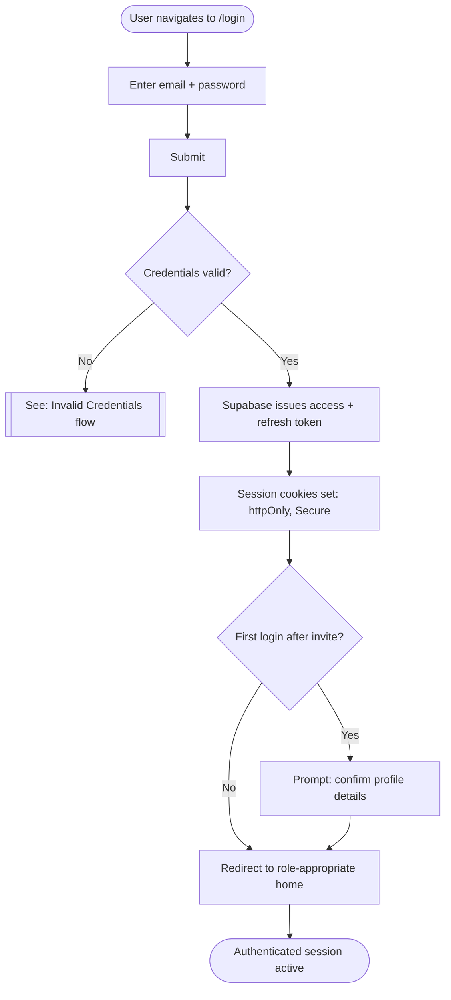
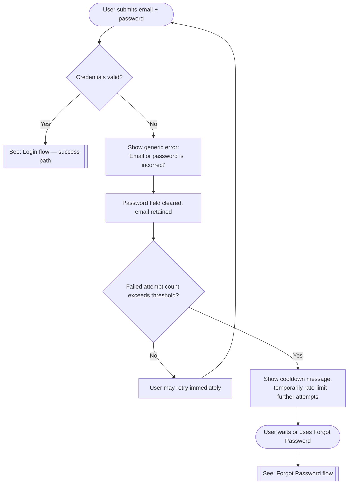
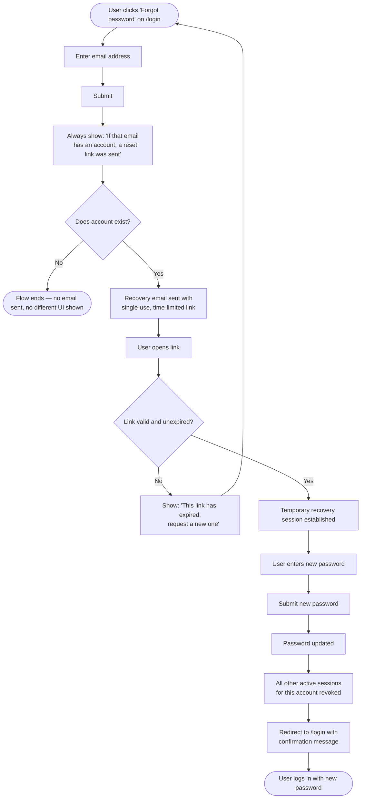
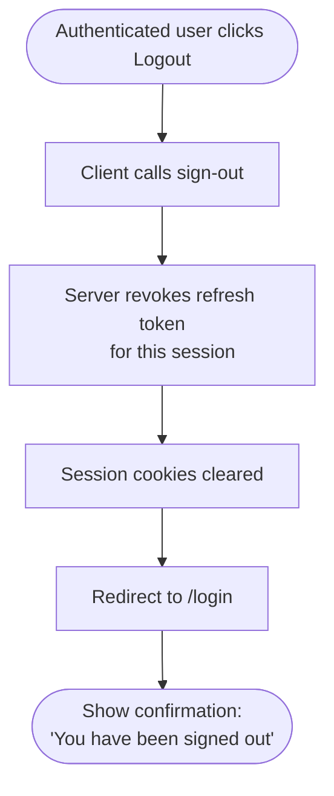
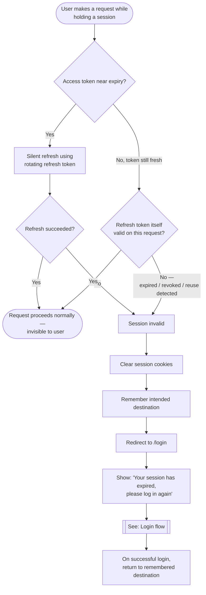
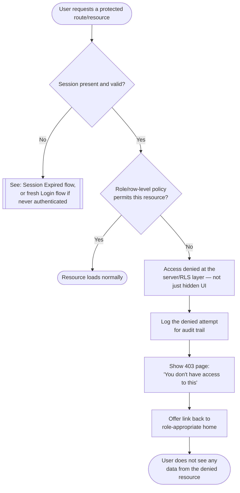

# Bimbel OS — Authentication User Flow

This document specifies the complete user-facing flow for authentication, as Mermaid flowcharts. It is a UX/flow design document — no routes, components, or code are created here. It builds directly on the decisions already made in [AUTHENTICATION.md](./AUTHENTICATION.md) (no public signup, invite-only provisioning, cookie-based sessions, rotating refresh tokens, enumeration-safe password reset) and [ROLE_PERMISSION_MATRIX.md](./ROLE_PERMISSION_MATRIX.md) (role-scoped access).

## Conventions Used in These Diagrams

- There is no public registration screen — every flow below assumes the user already has an account, provisioned by an Owner/Admin invite per [AUTHENTICATION.md](./AUTHENTICATION.md#authentication-flow-login-to-logout).
- "Role-appropriate home" means: Owner → Business Snapshot / dashboard, Admin → operational workspace, Teacher → their assigned Classes/Attendance view — the specific routes are not yet decided and are out of scope for this document.
- Error messaging is deliberately generic wherever it could otherwise leak whether an account/email exists — consistent with the enumeration-safety principle already established for password reset.

---

## 1. Login

The baseline flow: an already-provisioned staff member authenticating with email + password.

---

## 2. Invalid Credentials

Expands the failure branch of Login. The message is intentionally generic — it never confirms or denies whether the submitted email has an account, to avoid user enumeration.

---

## 3. Forgot Password

Mirrors the Password Reset Flow defined in [AUTHENTICATION.md](./AUTHENTICATION.md#password-reset-flow): enumeration-safe request, single-use time-limited link, and revocation of all other active sessions on success.

---

## 4. Logout

User-initiated sign-out. Revocation happens server-side, not just a client-side cookie clear, per [AUTHENTICATION.md](./AUTHENTICATION.md#authentication-flow-login-to-logout).

---

## 5. Session Expired

Two distinct triggers: a routine silent refresh (invisible to the user, happy path) versus a refresh token that's no longer valid — inactivity timeout, manual revocation, or rotation-reuse detection per [AUTHENTICATION.md](./AUTHENTICATION.md#refresh-token-strategy). Only the second is user-visible. The user's intended destination is preserved so re-login returns them to where they were, minimizing lost work.

---

## 6. Unauthorized Access

Covers two different conditions that both land on a denial, per [ROLE_PERMISSION_MATRIX.md](./ROLE_PERMISSION_MATRIX.md#scoping--enforcement): no session at all, versus a valid session whose role/scope doesn't cover the requested resource (e.g., a Teacher navigating directly to an Invoice URL, or a resource outside their assigned Classes). The denial is enforced server-side regardless of what the UI would have otherwise shown.

---

## How These Flows Connect

- **Login** is the entry point every other flow eventually returns to (after logout, after session expiry, after a completed password reset).
- **Invalid Credentials** is a sub-flow of Login's failure branch, not a separate entry point.
- **Session Expired** and **Unauthorized Access** are distinguished deliberately: one is "we don't know who you are anymore," the other is "we know who you are, and the answer is no." Conflating them would either leak permission structure to logged-out users or wrongly imply a permissions problem when the real issue is just an expired session.
- **Forgot Password** and **Logout** are the two flows that actively revoke session state — both terminate in a fresh, unauthenticated state at `/login`.
